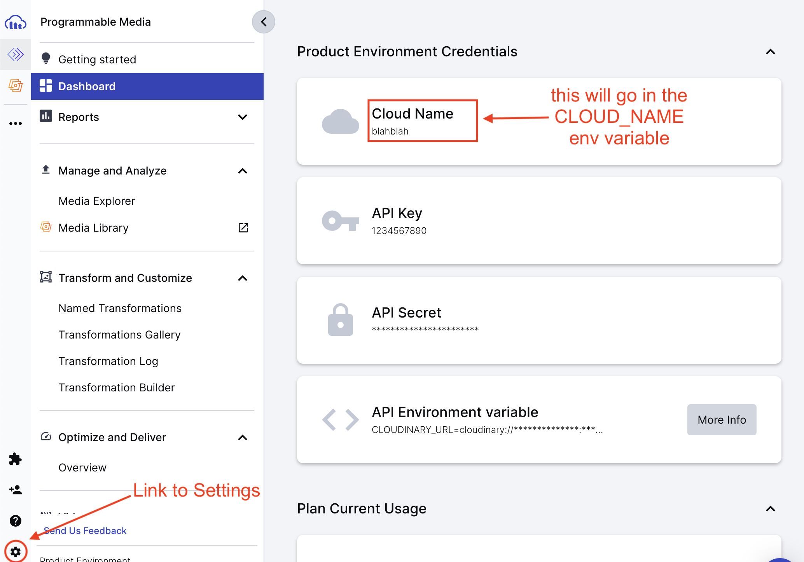

# Cloudinary Upload example

This example shows how to upload images to the [Cloudinary](https://cloudinary.com/) cloud service.

## Cloud architecture

It's easy to store strings and numbers into a MongoDB database, not so much doing the same with images as they are [binary data](https://en.wikipedia.org/wiki/Binary_file).

One could upload them to the `public` folder of the next project and make them available like other public assets. This would lead to multiple problems, namely:

- the project filesystem is volatile, gets recreated on every Vercel deployment and the files would be deleted;
- even so, having a single server for images, api and the React app may overload the whole thing.

Relying on a third party service is a good solution.

## Registering to Cloudinary

Signup at [Cloudinary](https://cloudinary.com/) first.

Once you are in, note down the **Cloud Name** from the [console](https://console.cloudinary.com/console):



Then go to the [settings](https://console.cloudinary.com/settings) page, into the **Upload** section, and edit the `ml_default` signing mode to **Unsigned**:


## Prepare the schema for images

We'll need the uploaded image URL and its dimensions:

```js
const schema = new Schema(
  {
    title: {
      type: String,
      required: true,
    },
    content: {
      type: String,
      required: true,
    },
    cover: {
      type: new Schema({
        width: Number,
        height: Number,
        url: String,
      }),
      required: true,
    },
  },
  { timestamps: true },
);
```

See how the cover has its own `Schema`, because it's an object.

**Note**: the DB has no notion of Cloudinary, it's just expecting an URL and the image sizes an data for the `cover` field.

The proof is that you can create a post without uploading anything via cURL like:

```
curl -i -X POST http://localhost:3000/api/posts \
  -H 'Content-Type: application/json' \
  -d '{ "title" : "Local Post", "content" : "Some Text", "cover": { "width": 600, "height": 400, "url": "https://dummyimage.com/600x400/000/fff" } }'
```

## Configuring Cloudinary for the browser

Add a `NEXT_PUBLIC_CLOUDINARY_CLOUD_NAME` variable in your `.env.local` file with the cloud name you registered from your Cloudinary Dashboard.

[This will expose the variable in your frontend code](https://nextjs.org/docs/pages/building-your-application/configuring/environment-variables#bundling-environment-variables-for-the-browser), like:

```js
const CLOUD_NAME = process.env.NEXT_PUBLIC_CLOUDINARY_CLOUD_NAME;
```

## The actual upload process

First we'll need a file input in the form:

```js
<label>
  Cover
  <input name="cover" type="file" required />
</label>
```

This will expose the selected file in the `submit` event as `event.target.cover.files[0]` (because we named the field `cover`).

### The upload function

Let's define the `upload` function as:

```js
const CLOUD_NAME = process.env.NEXT_PUBLIC_CLOUDINARY_CLOUD_NAME;
const UPLOAD_PRESET = "ml_default";

// ...

async function upload(file) {
  const formData = new FormData();
  formData.append("file", file);
  formData.append("upload_preset", UPLOAD_PRESET);
  const response = await fetch(
    `https://api.cloudinary.com/v1_1/${CLOUD_NAME}/image/upload`,
    {
      method: "POST",
      body: formData,
    },
  );
  const { url, width, height } = await response.json();
  return { url, width, height };
}
```

- the `CLOUD_NAME` and `UPLOAD_PRESET` are defined at the top of the file;
- the passed `file` parameter comes from the `submit` event (see above);
- the upload does not have the JSON content type, because we are sending a file;
- if the upload works, the response will include the needed `url`, `width` and `height` - let's return them!

### Saving the cover info in the database

We uploaded the image to Cloudinary, but we haven't told MongoDB about that yet! Let's do it:

```js
async function onSubmit(event) {
  event.preventDefault();
  try {
    const cover = await upload(event.target.cover.files[0]);
    await fetch("/api/posts", {
      method: "POST",
      body: JSON.stringify({
        ...Object.fromEntries(new FormData(event.target)),
        cover,
      }),
      headers: {
        "Content-Type": "application/json",
      },
    });
    mutate("/api/posts");
    router.push("/");
  } catch (error) {
    console.log(error);
    alert("Error creating post");
  }
}
```

- first we `upload` the file;
- then we make a fetch request of type `POST`, with the text data from the form, merged with the url / width / height of the cover;
- the rest is normal next / swr business: mutate the list of posts and route back to the homepage.

Nothing particular happens in the server, just `await Post.create(request.body)` as usual.